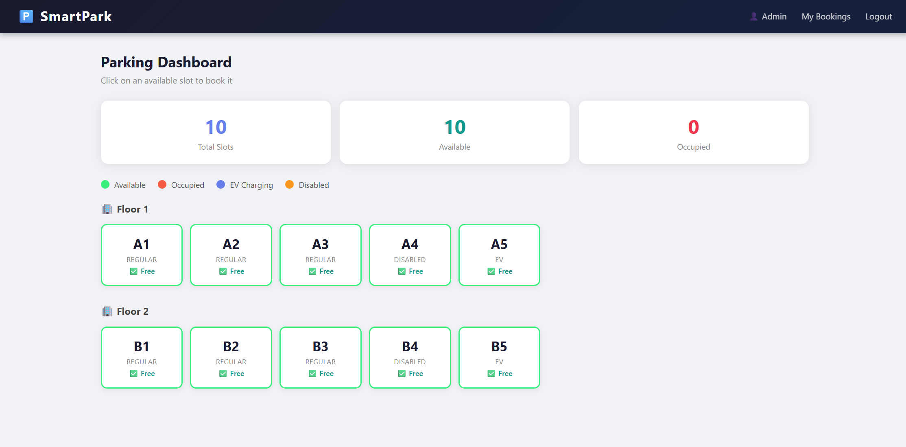
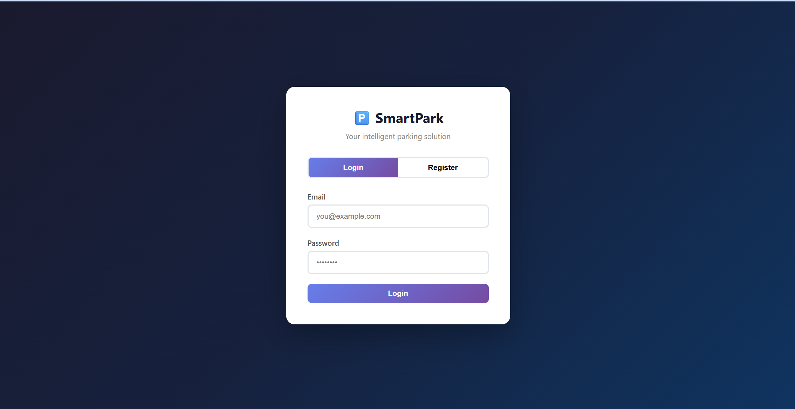
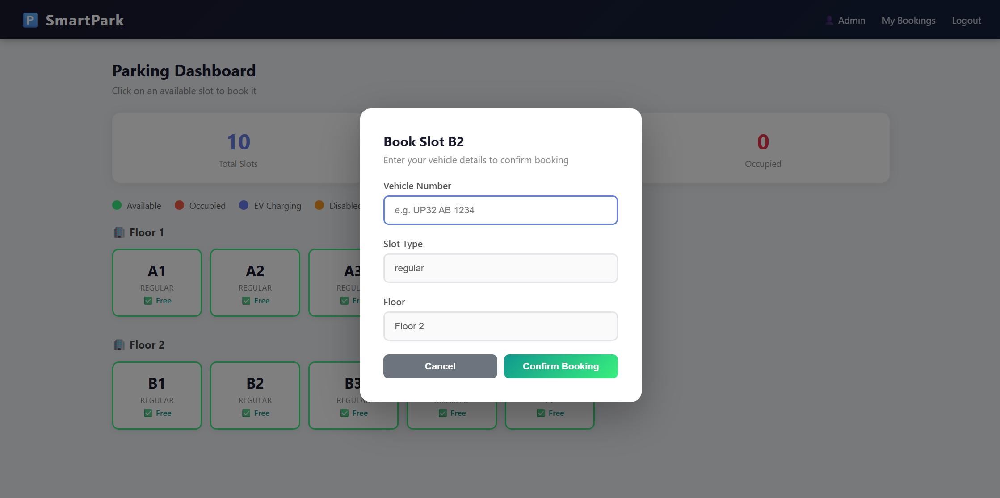
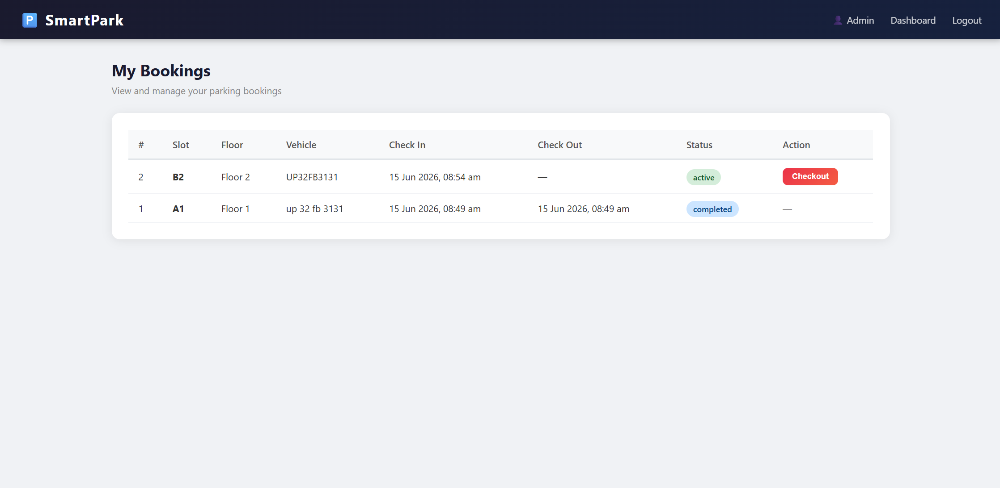

# 🅿️ Smart Parking System

A full-stack web application for managing parking slots in real time — built with Python (Flask), MySQL, and vanilla JavaScript.



---

## ✨ Features

- 🔐 User authentication (Register & Login)
- 🟢 Real-time parking slot availability (auto-refreshes every 30s)
- 📋 Book a parking slot with vehicle details
- 🔴 Slot status updates instantly on booking
- ✅ Checkout system that frees up slots
- 📊 Booking history with status tracking
- 👤 Admin & User roles
- 📱 Responsive design

---

## 🛠️ Tech Stack

| Layer      | Technology        |
|------------|-------------------|
| Frontend   | HTML, CSS, JavaScript |
| Backend    | Python, Flask     |
| Database   | MySQL             |
| API Style  | REST API          |
| Version Control | Git & GitHub |

---

## 📁 Project Structure
smart-parking-system/

├── backend/

│   ├── app.py              # Flask entry point

│   ├── db.py               # Database connection

│   ├── config.py           # DB credentials (gitignored)

│   ├── models/

│   │   └── helpers.py      # Reusable query functions

│   └── routes/

│       ├── auth.py         # Login & Register API

│       ├── slots.py        # Parking slots API

│       └── bookings.py     # Bookings API

├── frontend/

│   ├── templates/

│   │   ├── index.html      # Login / Register page

│   │   ├── dashboard.html  # Parking grid

│   │   └── bookings.html   # Booking history

│   └── static/

│       ├── css/style.css   # All styles

│       └── js/

│           ├── auth.js

│           ├── dashboard.js

│           └── bookings.js

├── screenshots/

├── requirements.txt

└── README.md

---

## 🚀 Getting Started

### Prerequisites
- Python 3.x
- MySQL
- Git

### 1. Clone the repository
```bash
git clone https://github.com/theadityabhadauriya/smart-parking-system.git
cd smart-parking-system
```

### 2. Create virtual environment
```bash
python -m venv venv
venv\Scripts\activate        # Windows
source venv/bin/activate     # Mac/Linux
```

### 3. Install dependencies
```bash
pip install -r requirements.txt
```

### 4. Set up the database
- Open MySQL Workbench
- Run the SQL from `database/schema.sql`

### 5. Configure database credentials
Create `backend/config.py`:
```python
DB_CONFIG = {
    'host': 'localhost',
    'user': 'root',
    'password': 'YOUR_PASSWORD',
    'database': 'smart_parking'
}
```

### 6. Run the backend
```bash
cd backend
python app.py
```

### 7. Open the frontend
Open `frontend/templates/index.html` in your browser.

---

## 📸 Screenshots

### Login Page


### Parking Dashboard


### Book a Slot


### My Bookings


---

## 🗄️ Database Schema
users

├── id, name, email, password, role, created_at
parking_slots

├── id, slot_number, slot_type, status, floor
bookings

├── id, user_id, slot_id, vehicle_number

├── check_in, check_out, status, created_at
---

## 🔗 API Endpoints

| Method | Endpoint | Description |
|--------|----------|-------------|
| POST | `/api/register` | Register new user |
| POST | `/api/login` | Login user |
| GET | `/api/slots` | Get all slots |
| GET | `/api/slots/available` | Get available slots |
| POST | `/api/bookings` | Create booking |
| GET | `/api/bookings/user/:id` | Get user bookings |
| PUT | `/api/bookings/:id/checkout` | Checkout booking |

---

## 👨‍💻 Author

**Aditya Bhadauriya**
- GitHub: [@theadityabhadauriya](https://github.com/theadityabhadauriya)

---

## 📄 License

This project is open source and available under the [MIT License](LICENSE).